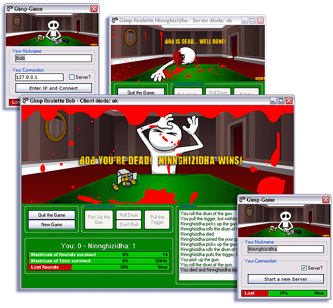



## Winsock Multiplayer Flash Game \(Gimp Roulette\)

### Description

Flash, Winsock TCP/IP, Chat, Server and Client - all in one application - and it's a multiplayer Internet/Network-Game. If you want you can call it: Russian Roulette. How does it work: Sends your local action FIRST to the Winsock-Control and execute it directly from the Winsock-Control, eg. Jump to the right flash-Frame.

----

Key-Features:

* Animations in Flash

* Control Flash-Frames trough VB

* Push variables into a Flash-File

* TCP/IP Server and client in one application

* Chat- Server/Client

* shows, if opponent gone offline

* Learn how to use Winsock to control another app

* Handshakes at winsock-load and -unload

* Background-Sound

* Statistics (Percent-Bar)

* Ini-File - Support

* clean and comented Code.

* Includes the .fla-File, to show how it works.

----

Bugs: None (If you find one, i'll update the file)

----

Votes & comments:

Yeah, would be cool - just try it and love it - i always wanted to win the contest :> If you don't vote, please drop me a line, that i know, what you think about it.

And now: Enjoy and vote :>
 
### More Info
 

             |
---                |---
**Submitted On**   |2002-10-10 21:28:08
**By**             |[Ninnghizidha](https://github.com/Planet-Source-Code/PSCIndex/blob/master/ByAuthor/ninnghizidha.md)
**Level**          |Advanced
**User Rating**    |4.9 (310 globes from 63 users)
**Compatibility**  |VB 6\.0
**Category**       |[Complete Applications](https://github.com/Planet-Source-Code/PSCIndex/blob/master/ByCategory/complete-applications__1-27.md)
**World**          |[Visual Basic](https://github.com/Planet-Source-Code/PSCIndex/blob/master/ByWorld/visual-basic.md)
**Archive File**   |[Winsock\_Mu14403610102002\.zip](https://github.com/Planet-Source-Code/ninnghizidha-winsock-multiplayer-flash-game-gimp-roulette__1-39709/archive/master.zip)

